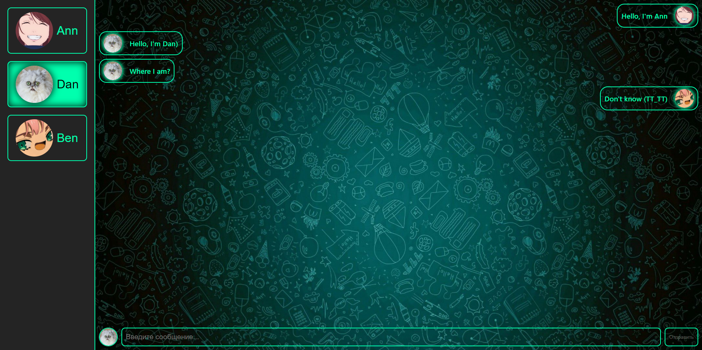

# Messenger + Redux Toolkit

### **Start app**

1. _Either clone or download the app and open the folder in the cli_
2. _Install all dependencies using the `yarn` command_
3. _Build the project using the `yarn build` command_
4. _Start the web server using the `yarn preview` command. The app will be served at http://localhost:4173/._

### **Start JSON-server**

1. _Start server using `yarn db` command_

---

 

<b>Screenshots</b>
    
  
<h3>Messenger</h3>

---

### **Technology stack:**

- _Vite_
- _React_
- _Typescript_
- _SCSS_
- _Redux Toolkit_
- _Axios_
- _json-server_
